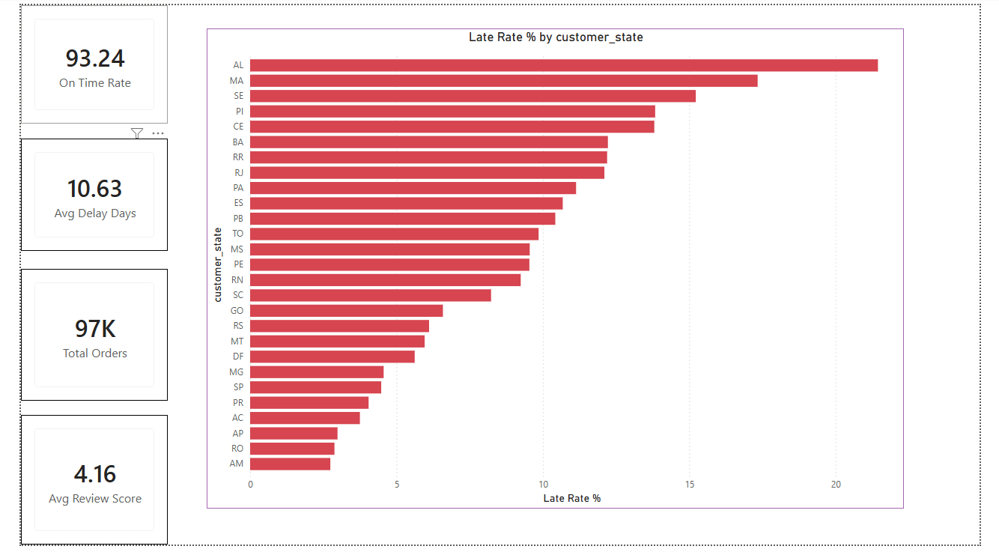
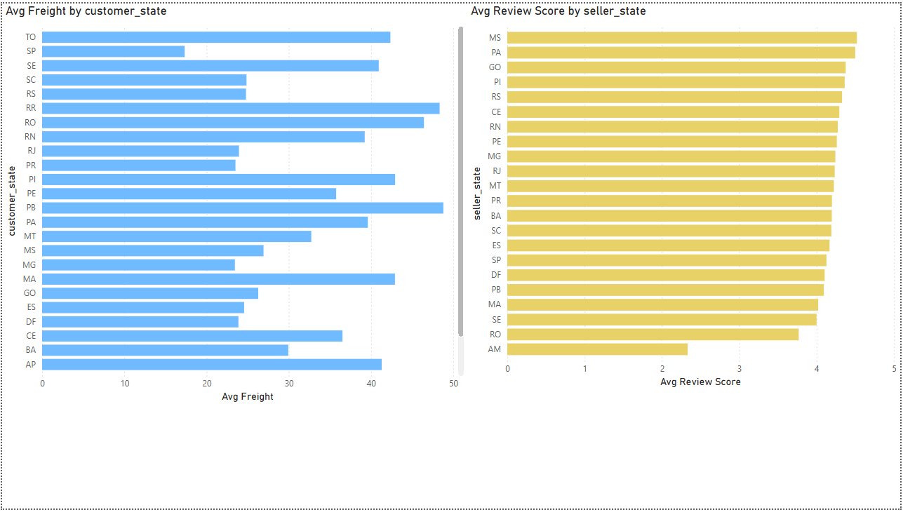
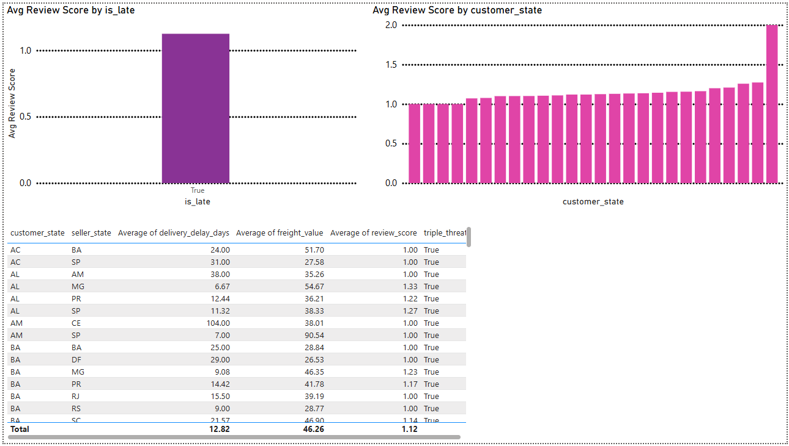
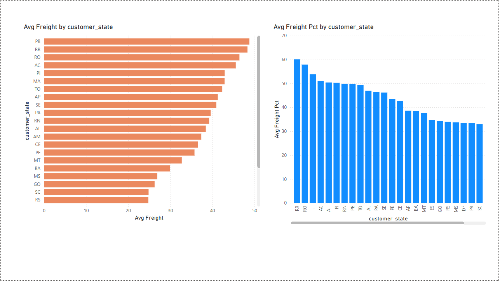

# Last Mile Delivery Analysis — Olist Dataset

This is a data analysis project I built to practice working with real-world messy data and turning it into something visual and useful. I used the Brazilian E-Commerce dataset by Olist which has about 100k orders from 2016 to 2018.

The main question I wanted to answer was: **why do some deliveries fail, and where does that hurt the business the most?**

---

## What I used

- Python + pandas for cleaning and merging the data
- Jupyter Notebook for the analysis
- Power BI for the dashboard

---

## The data

Olist provides several CSV files that all need to be joined together. I merged orders, customers, sellers, order items, products, and reviews into one master table. After filtering to only delivered orders I ended up with around 96,000 rows.

I then created a few new columns that I needed for the analysis:

- `delivery_delay_days` — difference between actual and estimated delivery date
- `is_late` — True if the order arrived after the estimated date
- `freight_pct_of_price` — how much of the product's price was just shipping
- `triple_threat` — a flag I created for orders that were late, had expensive freight, AND got a bad review (1 or 2 stars). These are the worst-case orders.

---

## Dashboard Preview

### Overview

### Delay Analysis

### Seller & Region

### Customer Satisfaction

### Freight Optimization

---

## What I found

A few things stood out to me:

- Geographic isolation is the biggest factor. The worst states for delay, freight cost, and reviews are almost always the remote northern ones.
- Olist's delivery got worse as it scaled. The late rate grew 8x in two years which suggests the logistics side didn't keep up with order growth.
- Late delivery is the main reason customers leave bad reviews. It's not really about the product.
- The 1,234 triple threat orders are where Olist loses both money and customers at the same time. That's probably the most actionable finding.

---

## How to run it

1. Download the Olist dataset from Kaggle
2. Update the file paths in the notebook and run all cells
3. Open the .pbix file in Power BI Desktop and point it to olist_master.csv

Dataset link: https://www.kaggle.com/datasets/olistbr/brazilian-ecommerce